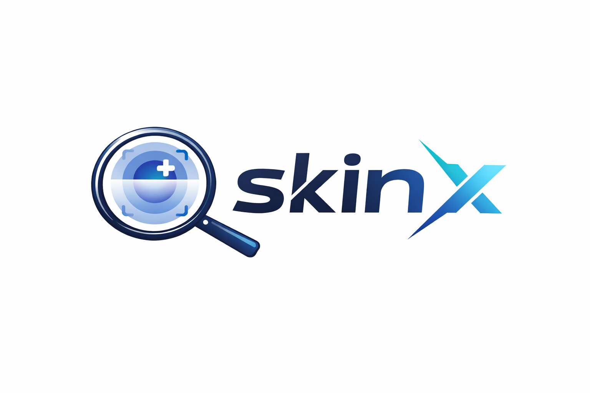
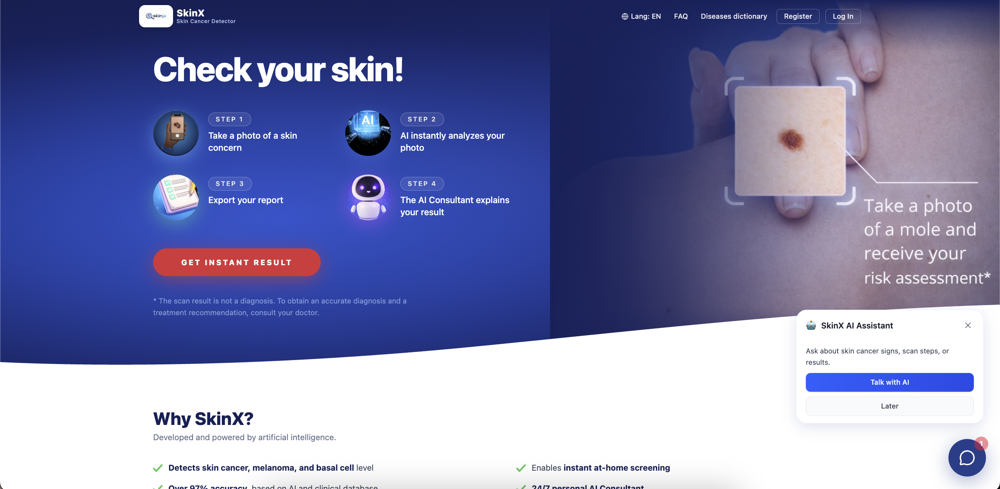
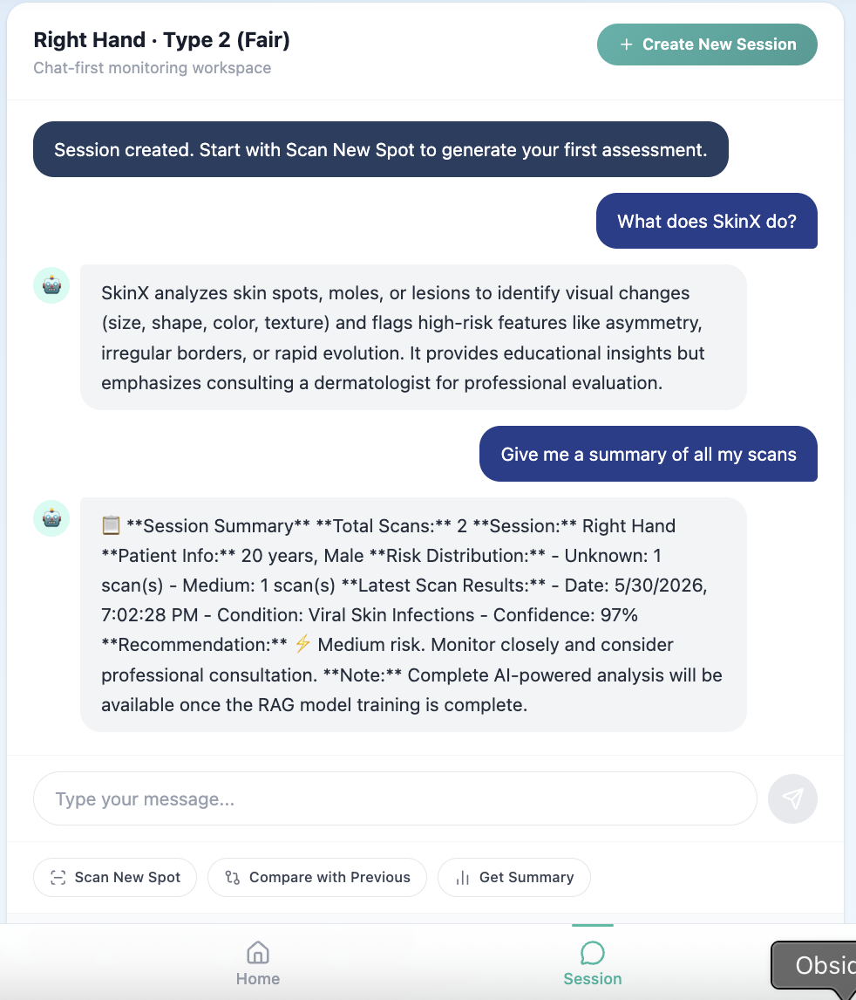
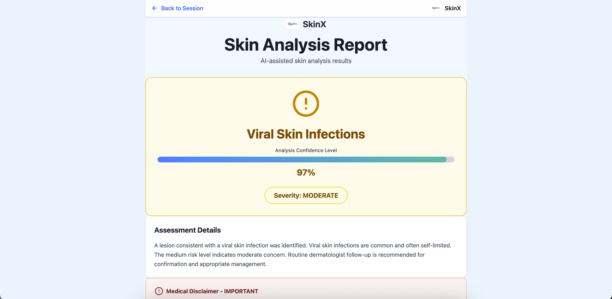
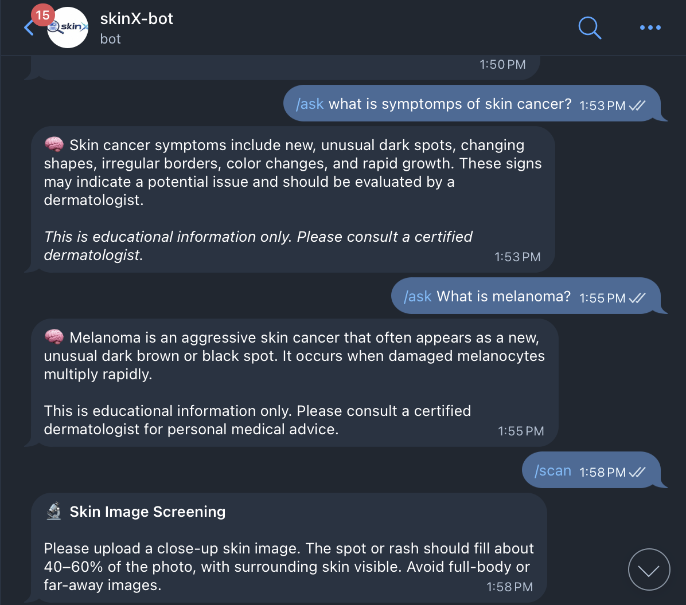
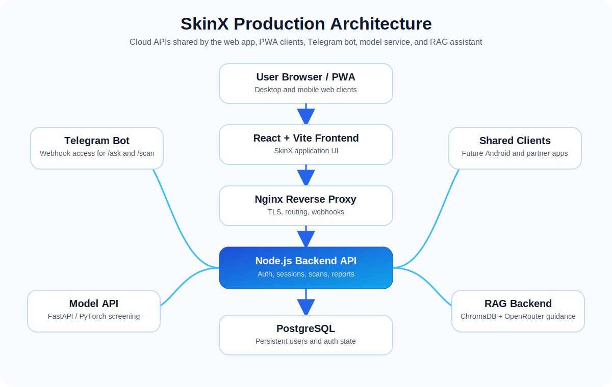

<p align="center">
  
</p>

<h1 align="center">SkinX</h1>

<p align="center">
  <strong>AI-assisted skin screening, dermatology-aware guidance, and longitudinal skin monitoring.</strong>
</p>

<p align="center">
  SkinX is a cloud-based skin-health platform that combines image analysis, RAG-powered education, secure authentication, session workspaces, report generation, and Telegram bot access.
</p>

<p align="center">
  <a href="https://skin-x.app"><strong>Live App</strong></a>
  ·
  <a href="#features"><strong>Features</strong></a>
  ·
  <a href="#architecture"><strong>Architecture</strong></a>
  ·
  <a href="#deployment"><strong>Deployment</strong></a>
  ·
  <a href="#medical-disclaimer"><strong>Disclaimer</strong></a>
</p>

<p align="center">
  
  
  
  
  
</p>

---

<p align="center">
  
</p>

---

## Table of Contents

- [Overview](#overview)
- [Problem](#problem)
- [Solution](#solution)
- [Features](#features)
- [Product Tour](#product-tour)
- [Architecture](#architecture)
- [Technology Stack](#technology-stack)
- [Monorepo Structure](#monorepo-structure)
- [Core Services](#core-services)
- [Authentication and Persistence](#authentication-and-persistence)
- [AI Model Pipeline](#ai-model-pipeline)
- [RAG Assistant](#rag-assistant)
- [Telegram Bot](#telegram-bot)
- [PWA Install Support](#pwa-install-support)
- [Deployment](#deployment)
- [Environment Variables](#environment-variables)
- [Roadmap](#roadmap)
- [Contributing](#contributing)
- [Medical Disclaimer](#medical-disclaimer)
- [License](#license)

---

## Overview

**SkinX** is an AI-assisted skin-health platform designed to help users better understand skin concerns through image-based screening, educational guidance, and follow-up monitoring.

The platform includes:

- a production React web application,
- secure email/password authentication,
- PostgreSQL-backed persistent user storage,
- SendGrid-powered OTP and password reset email flow,
- AI image analysis through a Python model API,
- RAG-powered skin-health Q&A,
- session-based workspace experience,
- Telegram bot support for `/ask` and `/scan`,
- Dockerized production deployment,
- GitHub Actions CI/CD,
- PWA install support for desktop and mobile browsers.

SkinX is designed as a **cloud-based platform**, not an edge/offline model app. The frontend, Android app, Telegram bot, and future clients should all use the same cloud APIs.

---

## Problem

Many people notice skin changes but do not know:

- whether a spot looks concerning,
- what warning signs to track,
- how to compare skin changes over time,
- when to seek professional care,
- how to access understandable skin-health education quickly.

At the same time, AI-based health tools must be careful. They should support awareness and education, not replace clinical diagnosis.

---

## Solution

SkinX provides a supportive workflow:

1. The user registers and verifies their email.
2. The user uploads a skin image.
3. The backend forwards the image to the model API.
4. The model pipeline validates the image, segments the region, and classifies the likely condition.
5. If confidence is acceptable, a short AI-generated narrative report is produced.
6. If confidence is weak, SkinX returns an uncertain result instead of forcing a diagnosis.
7. The user can ask skin-health questions through the RAG assistant.
8. Telegram users can use `/ask` for education and `/scan` for image screening.
9. User accounts persist through PostgreSQL, so backend restarts do not erase users.

---

## Features

### Skin Image Screening

- Upload skin images from the web app.
- Telegram `/scan` image upload support.
- Multi-stage image validation.
- MedSAM-based segmentation flow.
- EfficientNet-B5 classification using the deployed `incremental_b5.pt` model.
- Confidence and uncertainty guardrails.
- Safe fallback for low-confidence or invalid images.

### AI Analysis Report

- Structured condition summary.
- Severity and risk-level display.
- Suggestions for monitoring and dermatologist consultation.
- Educational disclaimer included.
- LLM/SLM-generated narrative when confidence is sufficient.

### RAG Skin-Health Assistant

- Ask questions such as:
  - “What is melanoma?”
  - “What are signs of skin cancer?”
  - “What is basal cell carcinoma?”
  - “How should I track changes in a mole?”
- Uses custom SkinX knowledge chunks.
- ChromaDB vector store.
- Qwen embedding model.
- OpenRouter-based response generation.
- Safe fallback for out-of-scope questions.

### Secure Authentication

- Email/password registration.
- OTP verification by email.
- SendGrid email delivery.
- Password reset support.
- bcrypt password hashing.
- JWT-based login flow.
- PostgreSQL-backed persistent storage.
- Users remain available after backend restart/redeploy.

### Session Workspace

- Chat-first monitoring workspace.
- Skin profile context such as age, gender, skin tone, region, and body area.
- Scan workflow from the session interface.
- Compare-with-previous and summary flow planned around session state.
- RAG chat integrated into the workspace.

### Telegram Bot

- `/start` onboarding.
- `/help` support and medical disclaimer.
- `/ask` skin-health questions through the same RAG backend.
- `/scan` image upload through the same production analysis route.
- Webhook-based deployment through Nginx.
- Temporary image handling with cleanup.

### PWA Install Support

- Browser-native install support for Chrome, Edge, Brave, and Android Chrome.
- iOS Safari Add to Home Screen guidance.
- Web app manifest.
- Service worker.
- Offline fallback.
- Safe caching strategy that avoids storing medical images, auth responses, scan results, or RAG responses.

---

## Product Tour

<p align="center">
  
</p>

### 1. Register and Verify

Users create an account using email and password. OTP verification is sent using SendGrid. Passwords are hashed using bcrypt and stored in PostgreSQL.

### 2. Start a Skin Session

The user enters a session workspace with skin context such as body area, skin type, age, gender, and region.

### 3. Upload a Skin Image

The user uploads a close-up image of a skin concern. The backend receives the image and forwards it to the model API.

### 4. AI Screening Pipeline

The model API validates the image, segments the region, classifies the condition, and applies uncertainty thresholds.

### 5. View Report

If confidence is sufficient, the user receives a structured educational report. If confidence is weak, SkinX asks for a clearer image instead of forcing a result.

### 6. Ask Follow-Up Questions

The user can ask skin-health questions using the RAG assistant.

### 7. Telegram Access

The same assistant and scan workflow are available from the Telegram bot.

---

## Screenshots

Product screenshots are stored under `docs/assets/`.

| Homepage | Session Workspace |
|---|---|
|  |  |

| Scan Result | Telegram Bot |
|---|---|
|  |  |

---

## Architecture

<p align="center">
  
</p>

```text
User Browser / PWA
        |
        v
React + Vite Frontend
        |
        v
Nginx Reverse Proxy
        |
        +----------------------+
        |                      |
        v                      v
Node.js Backend API       Telegram Bot
        |
        +-------------------+--------------------+
        |                   |                    |
        v                   v                    v
PostgreSQL             Model API             RAG Backend
Persistent Auth        FastAPI/PyTorch       ChromaDB + OpenRouter
                            |
                            v
             EfficientNet + MedSAM + MobileNetV3
```
